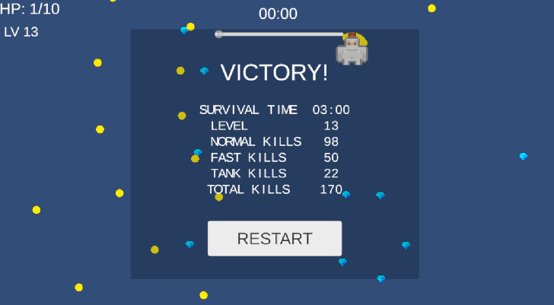

# Skill Survivor

**Skill Survivor** is a top-down 2D survival shooter prototype developed with **Unity 6** and **C#**. The player moves through an increasingly dangerous arena, automatically attacks nearby enemies, collects experience gems, and builds a different set of combat upgrades during each run.

The objective is simple: survive for **180 seconds**. Reaching zero HP ends the run in defeat; surviving until the timer expires results in victory.

## Screenshots




> A short gameplay GIF or video showing combat, a level-up choice, and the result screen will be added to the repository.

## Gameplay Loop

1. Normal, Fast, and Tank enemies spawn around the player and continuously pursue them.
2. The player automatically targets the nearest enemy and fires projectiles.
3. Defeated enemies drop experience gems with configurable experience rewards.
4. Leveling up pauses the run and presents three random, non-duplicated upgrades from a pool of six.
5. Enemy health, movement speed, spawn rate, and enemy composition scale over time.
6. The run ends with a unified Victory or Game Over result screen and a combat statistics summary.

## Controls

| Action | Keyboard | Mouse |
| --- | --- | --- |
| Move | `WASD` or Arrow Keys | — |
| Navigate upgrade choices | `W/S`, `A/D`, Arrow Keys, or `Tab` | Hover over a button |
| Confirm upgrade | `Enter` or `Space` | Left click |
| Restart after a run | `Enter` or `Space` | Click Restart |

## Features

### Combat

- Automatic nearest-enemy targeting
- Rigidbody2D and Collider2D-based combat interactions
- Multishot with configurable projectile count and spread angle
- Projectile piercing with per-projectile hit tracking
- Damage, fire-rate, projectile-size, multishot, piercing, and movement-speed upgrades
- Protection against duplicate projectile hits, repeated gem collection, and repeated enemy death logic

### Progression and Difficulty

- Experience gems and level progression
- Six-upgrade pool with three randomized, non-duplicated choices per level
- Keyboard and mouse upgrade-menu navigation
- Normal, Fast, and Tank enemy variants
- Per-enemy health, speed, and experience-reward settings
- Time-based difficulty scaling for spawn interval, enemy statistics, and enemy composition

### Game Flow and Presentation

- 180-second survival mode
- Unified game-session state that prevents Victory and Game Over from triggering together
- Result screen showing survival time, player level, per-type kills, and total kills
- Restart support through UI, `Enter`, or `Space`
- Pixel-art characters and experience gem
- Sound effects for shooting, enemy death, gem pickup, level-up, UI confirmation, victory, and defeat
- HP, experience, level, timer, upgrade, victory, and defeat UI

## Technical Highlights

- **Component-based design:** movement, auto-attack, projectiles, enemy behaviour, health, experience, UI, audio, spawning, difficulty, and session state are separated into focused MonoBehaviour components.
- **Event-driven UI:** level-up and game-end events notify the relevant UI instead of requiring those panels to control gameplay systems directly.
- **Runtime upgrade binding:** the three upgrade buttons are reused as dynamic choice slots and receive new labels and callbacks for each level-up.
- **Fisher-Yates shuffle:** upgrade options are shuffled before three choices are displayed, preventing duplicates within a single selection.
- **Safe piercing logic:** each projectile keeps an independent set of enemies it has already hit, allowing different projectiles to damage the same enemy without one projectile damaging it repeatedly.
- **Centralized session state:** a single game-session component records statistics and accepts only the first valid end-game result.
- **Centralized audio playback:** short sound effects use a persistent scene-level audio component so sounds can finish after enemies or gems are destroyed.

## Tech Stack

- **Engine:** Unity 6 (Unity hub 6.5)
- **Language:** C#
- **Input:** Unity Input System
- **UI:** Unity UI and TextMeshPro
- **Version Control:** Git and GitHub

## Project Structure

The repository contains the Unity source files required to open and continue development:

```text
Assets/
Packages/
ProjectSettings/
```

Unity-generated folders such as `Library/`, `Temp/`, `Logs/`, `Obj/`, and build output folders should be excluded through `.gitignore`.

## Running the Project in Unity

1. Clone the repository.
2. Open the project through Unity Hub.
3. Use the Unity version specified in `ProjectSettings/ProjectVersion.txt` when possible.
4. Open the main scene from `Assets/Scenes`.
5. Enter Play Mode.

## Build Availability

The Unity source project is currently available in this repository. A playable Windows build and/or WebGL build will be published separately after final build testing.

## Project Status

**Playable portfolio prototype — core development complete.**

The current version contains a complete gameplay loop, randomized character progression, escalating difficulty, audiovisual feedback, victory and defeat conditions, and end-of-run statistics. Future work may include a simple arena background, additional balancing, performance profiling, and platform-specific build testing.

## Third-Party Assets

This project uses third-party character, gem, and audio assets released under **Creative Commons CC0**. CC0 attribution is not legally required, but asset sources and license information are retained to document provenance and distinguish third-party content from original project code.

- Character art and selected audio assets: [Kenney](www.kenney.nl)
- Gem artwork: CC0-licensed third-party asset on opengameart

Third-party assets remain subject to their original licenses and are not covered by the proprietary source-code notice below.

## License

Copyright © 2026 Alex L. All rights reserved.

The source code in this repository is publicly available for portfolio review and educational reference only. No permission is granted to copy, redistribute, modify, publish, sublicense, or use it in commercial projects.

This repository is **not an open-source project** unless a separate written license explicitly states otherwise.
