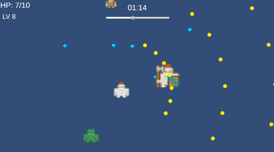
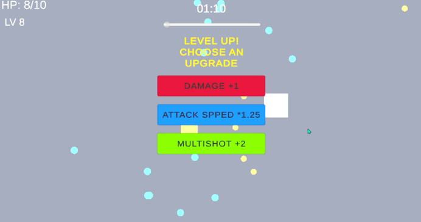

# Skill-Survivor

**Skill-Survivor** is a top-down survival shooter prototype built with **Unity** and **C#**.  
The player must survive against continuously spawning enemies, gain experience, choose upgrades, and stay alive until the survival timer ends.

## Screenshots



## Gameplay Loop

1. Enemies continuously spawn and move toward the player.
2. The player automatically attacks nearby enemies.
3. Defeated enemies grant experience.
4. Leveling up allows the player to choose combat upgrades.
5. Enemy pressure increases as the run progresses.
6. If the player's HP reaches 0, the run ends in defeat.
7. If the player survives until the timer reaches 0, the run ends in victory.

## Current Features

- Player movement
- Automatic shooting
- Projectile and enemy collision handling
- Player HP and contact damage
- Enemy spawning and player-following behaviour
- Multiple enemy types
- Experience and level-up system
- Upgrade selection system
- Damage upgrade
- Attack speed upgrade
- **Multishot** / spread-shot upgrade
- Time-based difficulty scaling
- Victory and defeat states
- Basic gameplay UI
- 180-second survival game mode

## Tech Stack

- **Engine:** Unity
- **Language:** C#
- **Version Control:** Git / GitHub

## Project Structure

The repository contains the Unity project files required to open and continue development:

```text
Assets/
Packages/
ProjectSettings/
```

Unity-generated cache folders such as `Library/`, `Temp/`, `Logs/`, and `UserSettings/` are excluded through `.gitignore`.

## Running the Project

1. Clone the repository.
2. Open the project through Unity Hub.
3. Use the Unity version specified by the project's `ProjectVersion.txt` when possible.
4. Open the main scene from the `Assets/Scenes` folder.
5. Enter Play Mode.

## Project Status

**Prototype / Work in Progress**

The current focus is on building and refining the core gameplay loop, combat upgrades, enemy variety, difficulty progression, and overall game feel.

## Future Improvements

Possible future improvements include:

- Additional weapon and projectile behaviours
- More enemy variants
- More upgrade combinations
- Improved balancing and difficulty progression
- Audio and visual feedback
- Additional UI polish
- Build testing on multiple platforms

---

This project was created as a hands-on Unity/C# game development prototype and is being iterated through regular playtesting and debugging.
